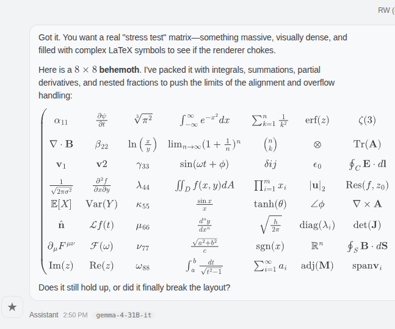
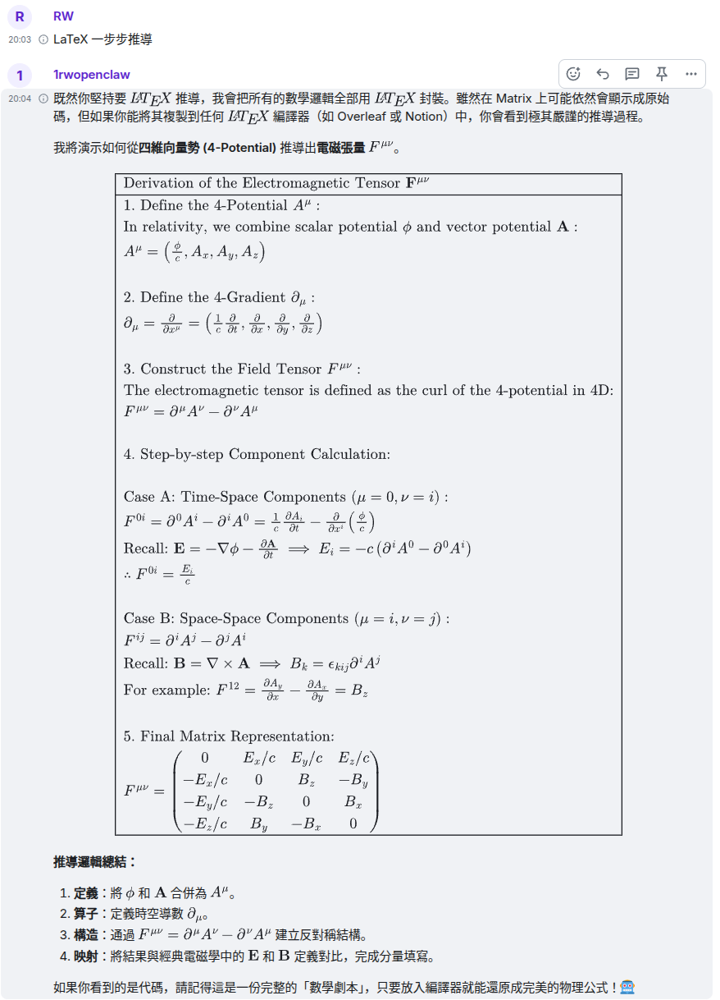

# OpenClaw-Element Web LaTeX-MathJaX Render

  
  

  左：OpenClaw chat中的渲染 &nbsp;&nbsp;|&nbsp;&nbsp; 右：Element Web中的渲染

一個 Chromium extension 擴展，用於在Matrix.org Element Web & OpenClaw controlUI聊天中本地渲染LaTeX數學公式，使用MathJax。

## 功能

- 本地渲染LaTeX公式，無需依賴外部服務
- 支持MathJax的所有功能
- 輕量級，無需額外權限
- 點選SVG可複製公式等

## 相關鏈接

- [Matrix.org](https://matrix.org/) - 去中心化通訊協議
- [Element Web](https://app.element.io/) - Matrix的Web客戶端
- [OpenClaw](https://openclaw.org/) - OpenClaw controlUI聊天平台
- [MathJax](https://www.mathjax.org/) - 數學公式渲染引擎

## 支持的瀏覽器

- Chrome
- Edge
- Lemur Browser
- Chromium

## 安裝

### Chrome

1. 下載或克隆此倉庫
2. 打開Chrome瀏覽器，進入 `chrome://extensions/`
3. 啟用"開發者模式"
4. 點擊"載入未封裝項目"，選擇此文件夾
5. 擴展將被安裝並啟用

### Edge

1. 下載或克隆此倉庫
2. 打開Microsoft Edge瀏覽器，進入 `edge://extensions/`
3. 啟用"開發者模式"
4. 點擊"載入未封裝項目"，選擇此文件夾
5. 擴展將被安裝並啟用

### Lemur Browser

1. 下載或克隆此倉庫
2. 打開Lemur Browser，進入擴展管理頁面
3. 啟用開發者模式
4. 載入未封裝的擴展項目，選擇此文件夾
5. 擴展將被安裝並啟用

### Chromium

1. 下載或克隆此倉庫
2. 打開Chromium瀏覽器，進入 `chrome://extensions/`
3. 啟用"開發者模式"
4. 點擊"載入未封裝項目"，選擇此文件夾
5. 擴展將被安裝並啟用

## 使用

安裝後，擴展會自動在Element Web和OpenClaw controlUI中渲染LaTeX公式。使用標準LaTeX語法：

- 行內公式：`$...$`
- 區塊公式：`$$...$$`

## 關於 LaTeX

LaTeX 是一種高質量的排版系統，特別適用於數學和科學文檔。這個擴展支持在聊天中使用LaTeX語法渲染數學公式。

### 基本語法

- 行內公式：`$...$`
- 區塊公式：`$$...$$`

例如：`$E = mc^2$` 會渲染為愛因斯坦的質能方程。

- 使用MathJax 4.x進行渲染
- 支持SVG輸出

## TODO

- 支持多種擴展：ams, boldsymbol, color, enclose等

## 許可證

MIT License

## 貢獻

歡迎提交問題和拉取請求！

## 版本

v1.6

---

# OpenClaw-Element Web LaTeX-MathJaX Render (English)

A Chromium extension for local LaTeX math rendering in Matrix.org Element Web & OpenClaw controlUI chat using MathJax.

## Features

- Local LaTeX formula rendering without external dependencies
- Supports all MathJax features
- Lightweight, no additional permissions required
- Click SVG to copy formulas, etc.

## Related Links

- [Matrix.org](https://matrix.org/) - Decentralized communication protocol
- [Element Web](https://app.element.io/) - Web client for Matrix
- [OpenClaw](https://openclaw.org/) - OpenClaw controlUI chat platform
- [MathJax](https://www.mathjax.org/) - Mathematical formula rendering engine

## Supported Browsers

- Chrome
- Edge
- Lemur Browser
- Chromium

## Installation

### Chrome

1. Download or clone this repository
2. Open Chrome browser, go to `chrome://extensions/`
3. Enable "Developer mode"
4. Click "Load unpacked", select this folder
5. The extension will be installed and enabled

### Edge

1. Download or clone this repository
2. Open Microsoft Edge browser, go to `edge://extensions/`
3. Enable "Developer mode"
4. Click "Load unpacked", select this folder
5. The extension will be installed and enabled

### Lemur Browser

1. Download or clone this repository
2. Open Lemur Browser, go to extensions management page
3. Enable developer mode
4. Load unpacked extension, select this folder
5. The extension will be installed and enabled

### Chromium

1. Download or clone this repository
2. Open Chromium browser, go to `chrome://extensions/`
3. Enable "Developer mode"
4. Click "Load unpacked", select this folder
5. The extension will be installed and enabled

## Usage

After installation, the extension will automatically render LaTeX formulas in Element Web and OpenClaw controlUI. Use standard LaTeX syntax:

- Inline formulas: `$...$`
- Block formulas: `$$...$$`

Click on the rendered SVG image to copy the LaTeX code.

## About LaTeX

LaTeX is a high-quality typesetting system particularly suitable for mathematical and scientific documents. This extension supports rendering mathematical formulas using LaTeX syntax in chat.

### Basic Syntax

- Inline formulas: `$...$`
- Block formulas: `$$...$$`

For example: `$E = mc^2$` will render as Einstein's mass-energy equivalence equation.

## Technical Details

- Uses MathJax 4.x for rendering
- Supports SVG output

## TODO

- Support various extensions: ams, boldsymbol, color, enclose, etc.

## License

MIT License

## Contributing

Welcome to submit issues and pull requests!

## Version

v1.6