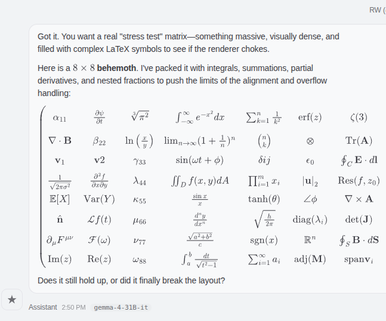
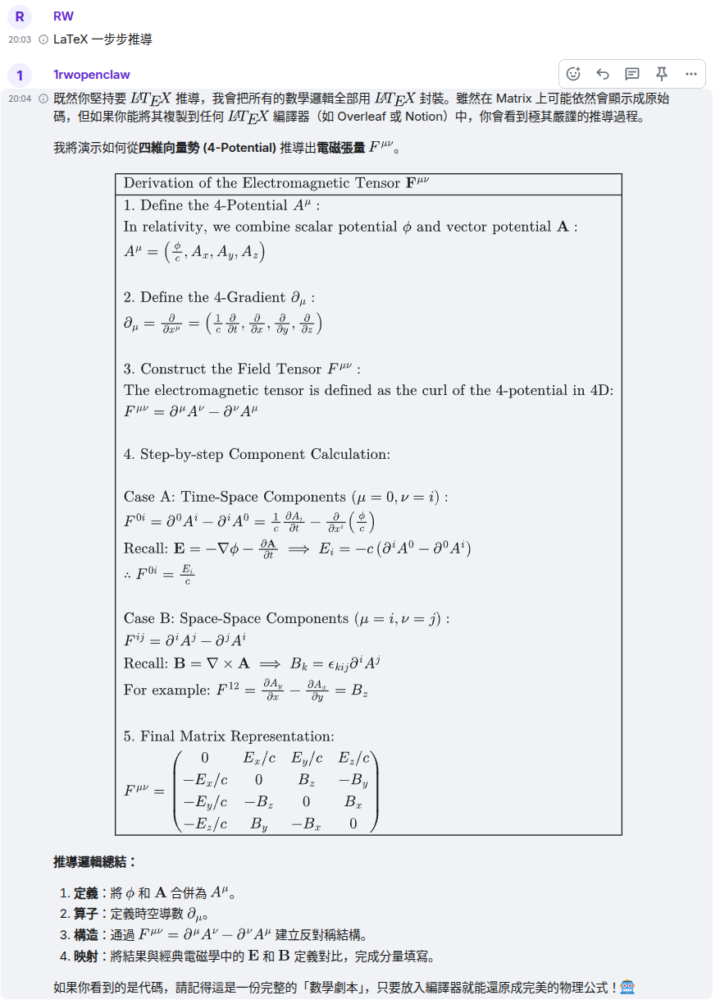

# OpenClaw-Element Web LaTeX-MathJaX Render

  
  

  左：OpenClaw chat中的渲染 &nbsp;&nbsp;|&nbsp;&nbsp; 右：Element Web中的渲染

一個 Chromium extension 擴展，用於在Matrix.org Element Web、Telegram Web、OpenClaw controlUI 聊天、Discord 及 Hermes agent 中本地渲染LaTeX數學公式，使用MathJax。

## 功能

- 本地渲染LaTeX公式，無需依賴外部服務
- 支持MathJax的所有功能
- 輕量級，無需額外權限
- 點選SVG可複製公式等
- 支持 Markdown 表格渲染（格子內可含 LaTeX）
- Discord 側邊欄收合：左緣浮動按鈕一鍵隱藏／展開頻道側邊欄，支援可自訂快捷鍵（預設 `Ctrl+B`）

## 相關鏈接

- [Matrix.org](https://matrix.org/) - 去中心化通訊協議
- [Element Web](https://app.element.io/) - Matrix的Web客戶端
- [OpenClaw](https://openclaw.org/) - OpenClaw controlUI聊天平台
- [Telegram Web](https://web.telegram.org/) - Telegram Web版客戶端
- [Discord](https://discord.com/) - Discord Web版
- [Hermes Agent](https://hermes-ai.org/) - Hermes AI Agent
- [MathJax](https://www.mathjax.org/) - 數學公式渲染引擎

## 支持的瀏覽器

- Chrome
- Edge
- Lemur Browser
- Chromium

## 安裝

### Chrome

1. 下載或克隆此倉庫
2. 打開Chrome瀏覽器，進入 `chrome://extensions/`
3. 啟用"開發者模式"
4. 點擊"載入未封裝項目"，選擇此文件夾
5. 擴展將被安裝並啟用

### Edge

1. 下載或克隆此倉庫
2. 打開Microsoft Edge瀏覽器，進入 `edge://extensions/`
3. 啟用"開發者模式"
4. 點擊"載入未封裝項目"，選擇此文件夾
5. 擴展將被安裝並啟用

### Lemur Browser

1. 下載或克隆此倉庫
2. 打開Lemur Browser，進入擴展管理頁面
3. 啟用開發者模式
4. 載入未封裝的擴展項目，選擇此文件夾
5. 擴展將被安裝並啟用

### Chromium

1. 下載或克隆此倉庫
2. 打開Chromium瀏覽器，進入 `chrome://extensions/`
3. 啟用"開發者模式"
4. 點擊"載入未封裝項目"，選擇此文件夾
5. 擴展將被安裝並啟用

## 使用

安裝後，擴展會自動在Element Web、Telegram Web、OpenClaw controlUI、Discord 及 Hermes agent 中渲染LaTeX公式。使用標準LaTeX語法：

- 行內公式：`$...$`
- 區塊公式：`$$...$$`

### Discord 側邊欄收合

在 Discord 網頁版會於畫面左緣中央出現一個浮動小標籤：

- 點一下：隱藏／展開頻道側邊欄
- 快捷鍵：預設 `Ctrl+B`
- 自訂快捷鍵：在浮動鈕上按右鍵進入錄製模式，按下新組合鍵即儲存（`Esc` 取消）
- 收合狀態與自訂快捷鍵會記憶於 `localStorage`，重整後保留

- 使用MathJax 4.x進行渲染
- 支持SVG輸出

## TODO

- 支持多種擴展：ams, boldsymbol, color, enclose等

## 許可證

MIT License

## 貢獻

歡迎提交問題和拉取請求！

## 版本

v1.11.0

---

# OpenClaw-Element Web LaTeX-MathJaX Render (English)

A Chromium extension for local LaTeX math rendering in Matrix.org Element Web, Telegram Web, OpenClaw controlUI chat, Discord and Hermes agent using MathJax.

## Features

- Local LaTeX formula rendering without external dependencies
- Supports all MathJax features
- Lightweight, no additional permissions required
- Click SVG to copy formulas, etc.
- Markdown table rendering with LaTeX support in cells
- Discord sidebar toggle: a floating button on the left edge hides/shows the channel sidebar, with a customizable hotkey (default `Ctrl+B`)

## Related Links

- [Matrix.org](https://matrix.org/) - Decentralized communication protocol
- [Element Web](https://app.element.io/) - Web client for Matrix
- [OpenClaw](https://openclaw.org/) - OpenClaw controlUI chat platform
- [Telegram Web](https://web.telegram.org/) - Telegram Web client
- [Discord](https://discord.com/) - Discord Web
- [Hermes Agent](https://hermes-ai.org/) - Hermes AI Agent
- [MathJax](https://www.mathjax.org/) - Mathematical formula rendering engine

## Supported Browsers

- Chrome
- Edge
- Lemur Browser
- Chromium

## Installation

### Chrome

1. Download or clone this repository
2. Open Chrome browser, go to `chrome://extensions/`
3. Enable "Developer mode"
4. Click "Load unpacked", select this folder
5. The extension will be installed and enabled

### Edge

1. Download or clone this repository
2. Open Microsoft Edge browser, go to `edge://extensions/`
3. Enable "Developer mode"
4. Click "Load unpacked", select this folder
5. The extension will be installed and enabled

### Lemur Browser

1. Download or clone this repository
2. Open Lemur Browser, go to extensions management page
3. Enable developer mode
4. Load unpacked extension, select this folder
5. The extension will be installed and enabled

### Chromium

1. Download or clone this repository
2. Open Chromium browser, go to `chrome://extensions/`
3. Enable "Developer mode"
4. Click "Load unpacked", select this folder
5. The extension will be installed and enabled

## Usage

After installation, the extension will automatically render LaTeX formulas in Element Web, Telegram Web, OpenClaw controlUI, Discord and Hermes agent. Use standard LaTeX syntax:

- Inline formulas: `$...$`
- Block formulas: `$$...$$`

Click on the rendered SVG image to copy the LaTeX code.

### Discord Sidebar Toggle

On Discord web a small floating tab appears at the left-center edge:

- Click: hide/show the channel sidebar
- Hotkey: default `Ctrl+B`
- Customize the hotkey: right-click the floating button to enter recording mode, then press a new key combination to save (`Esc` to cancel)
- The collapsed state and custom hotkey are persisted in `localStorage`

## Technical Details

- Uses MathJax 4.x for rendering
- Supports SVG output

## TODO

- Support various extensions: ams, boldsymbol, color, enclose, etc.

## License

MIT License

## Contributing

Welcome to submit issues and pull requests!

## Version

v1.11.0